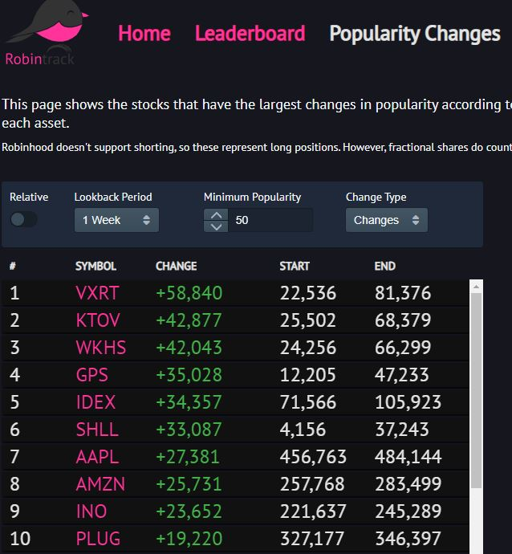

# Robinhood - A Fintech Case Study

---

## "Empowering the Individual Investor"
 
---

### Overview and Origin:

Robinhood is an online brokerage company that was founded with the thought that individual investors could be emowered through clean mobile-focused user interface, low fees, and *"outside-the-box"* investment tools.  The firm was founded by two former Stanford Univertity roommates who - after trying their hand in New York's finance industy - saw a clear need to create an individula investor-targeted online brokerage offering.  The company's strategy to hae no-fee trading has been a disruptive event that has set in motion massive upheaval in the industry over the last several months.

Vlad Tenev and Baiju Bhatt lived and worked in New York after college and started up two companies in a short amount of time. The first wwas an algorithmic trading company called Celeris and the second one was a financial software company called Chronos Research. [^1]  Seeing first-hand that institutions were paying little for trades relative to individual investors and that the online technology and research afforded to this investor class was lacking.

Robinhood was incorporated on April 18, 2013 and their initial funding was $3 million. [^2]  After their May 2020 $280 million funding they have now raised $1.2 billion over  eight separate funds which gets them to an $8.3 billion valuation. [^3] The most recent yearly (2018) revenue estimate was between $69 million and $100.6 million. [^4],[^18]

### Business Activities:

The company has tried to even the playing field for the younger, less-established investor class as it relates to competitive fees as well as research and trading tools.  The driving force for the firm's founding was a belief that the young individal investor has been at a competitive disadvantage as it relates to cost and information.  
Trading in equities, options (non-margin), and crypto is free with no minimum balances. There has been a lot of informal messaging coming out of the company that they are trying to get millennials to spend their daily allocated money on stock trading versus, say, coffee.  Penny  In addition, in late 2018 and into late 2019, Robinhood sought to get into personal banking in an attempt to expad their footprint in this demographic's finances.  During this time they were supposedly close to aligning with Ohio-based Sutton Bank where they would issue debit cards to customers and a supposed 3% annual interest rate to be given for bank depostis.  These deposits were to be SPIC-insured but the SPIC denied this. Robinhood had to wait until December 2019 to launch a "cash management" FDIC-backed product that would give customers a 1.8% rate on cash held at Robinhood. [^5]  

The age grouping that the firm has outlined as having the most traction with is the 28 to 41 year-old group. [^6]  In December of 2019, Robinhood signed up their 10 millionth custonmer. [^7]. Tenev was on televsion in late_april saying that Robinhood has been getting 50% of the national new brokerage accounts which is more then all the legacy players put together. [^8]  If it assumed that the company desires to be the one-stop shopping for all things financial for the  *"millennial"* generation (Ages 18 to 34) then there is more share to be gained for Robinhood as there are currently 75 million millennials in the US as of 2015. [^9]  Another huge advantage for Robinhood is that they interact with the customer via electronic infrastructure and at times phone (at a cost of $10/per call). A large component of the legacy online brokerage players have braicks and mortar overhead which affects their margins and potential competitiveness.

The company's competitive advantage is the fact that they were one of the *"first movers"* with the commission free trading platform and as a result they garnered a lot of insight into the investing methods and tendencies of smaller investors. [^10]  They are looked at as a "free" platform and is the appeal from a branding point of view when potential customers are wanting to deploy money. The interface is very easy to use and is very sleek and that appels to millennials versus using one of the stodgey offerings of the legacy players in the space. Robinhood has some pretty cool features where they have "leaderboard" and "popularity changes" which show the most popular holdings of Robinhood customers over various holding periods: 

The below shows the stock (ticker: AAL) and the pink line shows the stock's price while the green line shows the collective holdins og Robinhood members. This is obviously proprietary in nature as it is their userbase that is creating the graphical representation of holdings:

**Robinhood Millennial Customer Checklist:**

- [X] Free-ness
- [X] Sleek, Coolness Factor
- [X] Unique Proprietary Tools

As Robinhood himself said:

> **_"Steal From the Rich and TAKE from the Poor?"_**

Well so then how does Robinhood make money? They make money on cash balances, margining, and small money on customer deposits if they can use them to get a higher yield elsewhere. Back in October of 2018 they allowed that they were making almost half their revenues in payment for order flow.  That is, third-parties that pay Robinhood for their order flow so that they can dictate which routes the orders will be executed at. Meaning that the third party takes some sort of spread on a given trade to the detriment of the customer. It was discovered that Robinhood was entering into these transactions to the tune of sixty times more than average competitors. [^11][^12]

Robinhood is using some neat technology infrastructure in its leading low-cost FIntech offering.  They run a nightly batch process where they reconcile all customer trades for that day and its an arduous task.  They run these batch processes against single Postgres database (an open-source database management system (RDBMS)) and it used to take hours.  Their software engineers were able to address the shortcomings in the Postgres' structure and detected bottlenecks that they addresses which resulted in ten times faster processing speed.  They did not have to change any code to make this happen. [^13][^14]

They use Kafka to synchonize data messaging between all their independant microservices and databases. Their back-end achitectre is flexible to plug in additional microservices but the Kafka helps to make sure all scenarios are accounted for which is particularly important when there is the back and forth processig of sustomer money.

### Landscape:

Industry Players | Favorable attributes [^15]
---------------- | --------------------
TD Ameritrade | Best for Beginners
Fidelity | Best Research Experience
Charles Schwab | Best for IRA accounts
E-Trade | Best Web Platform
Interactive Brokers | Best for Professionals
TradeStation | Best Platform Technology
Robinhood | Zero Fees, Simple GUI and nuanced offerings

The trajectory of the online brokerage industry over the last twenty years has been one that has had various levels of success in trying to attain its ultimate goal: empowering the individual investor to make to be able to make their own investing decisions in an inexpensive fashion.  The industry has been one that has pushed the technoogial boundaries of the Fintech realm for the better part of twenty years.  Over the last 5 to 10 years there have been continuous tweaks lower to the fee/commission system to the benefit of the customer. Additionally, real-time quotes are now the norm rather than a paid-for expense. Technology offerings such as multi-study charting capabilities and valuation metrics have come a long way since the days of retail customers using yahoo finance to go along with a delayed quote trading system. THis has made for a generally better user experience versus past years:

The online brokerage industry is a Fintech industry that has undergone massive changes in the last year. Much of these changes occured after the industry saw several of its players try to differniate themselves by offering customers slightly varied platforms that provided things such as naunced research products and low to no fees on products such as ETFs.  In the fall of 2019, large player, Interactive Brokers, sought to gain market share by taking commissions to zero on ETF trades in their IB *"Lite"* service. [^16] About a month later, Charles Schwab sent shockwaves across the industry by taking fees to zero on all stock trading which forced TD, E-Trade, Ally, adn Fidelity to do the same a week later.  This *"race to zero"* on fees in the back half of 2019 led to a massive consolidation where only a few months later in January, Schwab and TD Ameritrade merged.  This was the eventual result of margins getting constantly compressed in the industry.

So you are getting free trading, much-improved tools and the safety of al these players being members of the Securities Investor Protection Corporation (SPIC). This means your investments have a $500,000 guarantee and cash has a guarantee of up to $250,000. [^17]

Metrics that the industry players use are obviously revenue and margins as well as customer growth. It's fair to say that due to the slashing of fees over the last year and ensuing consolidation - that margins have not been going the right way for the indsutry.  Against this backdrop Robinhood got its big break when the stock market crumbled in Q1'20.  Stocks got pounded and millennials were in *"buy-the-dip"* buy the dip mode.  Robinhood earned “nearly $100 million in fees for stock and options order flow” in Q1 2020. For context, the same part of Robinhood’s business was reported to have generated $69 million in revenue during all of 2018.[^18]

Right now the best metric to judge RObonhood on is market share. They are increading their customer base at a meteoric rate. so go from ??? to 10mm custimers on DEcemeber of lat year can be compared against, say, Charles Schwab which has had a discount brokerage business since 1974 and has 14 million accounts.

**Robinhood's Meteoric Rise:**

Year | Users [^19]
---------------- | --------------------
2017 | 2mm
2018| 3.7mm+
Jan. '20 | 10mm
Apr. '20 | 13mm

### Recommendations

In staying with the theme that the company has had about trying to get more of the customers wallet they should issue, with one or several vendors, a credit card wher they can earn points for its usage. Vendors that make sens are millennial favorites like Starbucks, Whole Foods, a clothing company like J. Crew and an airline that flies corridors that millennials frequent. With these points they can either buy stocks or earn interest.  It benefits Robinhood to get as much money under their roof as possible as they will be able to be more flexible with their operations and future projects. Robinhood can construct it so that all the points of tranaction can occur at the same place - on the Robinhood app. Robinhood will also be able to earn nominal amounts of money on the credit card transactions.  They already have an app in place that can take in money and make purchases so this technology should be able to sit on top of current infrastructure.  If they want to take the low cost route they should jsut do this via credit cards. If they want to get more of the upside they can create something similar to an apple that utilizes a near-field communication but that would be costly at this point and not likely support the heavy cost uplift.  Starting with a card first makes the most sense.

---

**Footnotes**

[^1]: [Tech Crunch](https://techcrunch.com/2013/04/18/robinhood-app/?_ga=2.116074886.1805704415.1593219206-71989368.1593219206) 
[^2]: [Forbes](https://www.forbes.com/sites/halahtouryalai/2014/02/26/forget-10-trades-meet-robinhood-new-brokerage-targets-millennials-with-little-cash/#57a27c5a7f48) 
[^3]: [Craft](https://craft.co/robinhood/funding-rounds) 
[^4]: [Growjo](https://growjo.com/company/Robinhood#:~:text=Estimated%20Revenue%20%26%20Financials,venture%20funding%20in%20May%202018.&text=Robinhood's%20total%20funding%20is%20%24539M.) 
[^5]: [CNBC Robinhood](https://www.cnbc.com/2019/10/08/robinhood-makes-second-attempt-at-launching-a-high-yield-account-similar-to-banks.html) 
[^6]: [Nasdaq Robinhood](https://www.nasdaq.com/articles/robinhood-millennial-obsession-2018-08-23) 
[^7]: [Blog Robinhood](https://blog.robinhood.com/news/2019/12/4/ten-million-thanks) 
[^8]: [Marker Medium](https://marker.medium.com/how-robinhood-convinced-millennials-to-trade-their-way-through-a-pandemic-1a1db97c7e08) 
[^9]: [Brookings](https://www.brookings.edu/research/millennials/) 
[^10]: [Quora](https://www.quora.com/What-s-the-advantage-of-Robinhood) 
[^11]: [Bloomberg](https://www.bloomberg.com/news/articles/2018-10-15/robinhood-gets-almost-half-its-revenue-in-controversial-bargain-with-high-speed-traders) 
[^12]: [WSJ.com](https://www.bloomberg.com/news/articles/2018-10-15/robinhood-gets-almost-half-its-revenue-in-controversial-bargain-with-high-speed-traders) 
[^13]: [RH Engineering Blog](https://robinhood.engineering/robinhood-hosts-its-first-tech-talk-eb01e35f239f) 
[^14]: [Stackshare](https://stackshare.io/kafka) 
[^15]: [Stockbrokers.com](https://www.stockbrokers.com/guides/online-stock-brokers) 
[^16]: [CNBC-2](https://www.cnbc.com/2019/10/13/battle-for-client-assets-heats-up-as-brokers-cut-fees-to-zero.html#:~:text=Interactive%20Brokers%20was%20among%20the,Lite%20service%20since%20late%20September.) 
[^17]: [Stocks&Coffee](https://stocksandcoffee.com/robinhood-vs-webull-vs-m1finance/) 
[^18]: [techcrunch](https://techcrunch.com/2020/06/23/amidst-robinhoods-planned-service-changes-a-tension-between-growth-and-safety/)
[^19]: [Marker Medium 2](https://marker.medium.com/how-robinhood-convinced-millennials-to-trade-their-way-through-a-pandemic-1a1db97c7e08)

[^10] [Marker Medium](https://marker.medium.com/how-robinhood-convinced-millennials-to-trade-their-way-through-a-pandemic-1a1db97c7e08)

